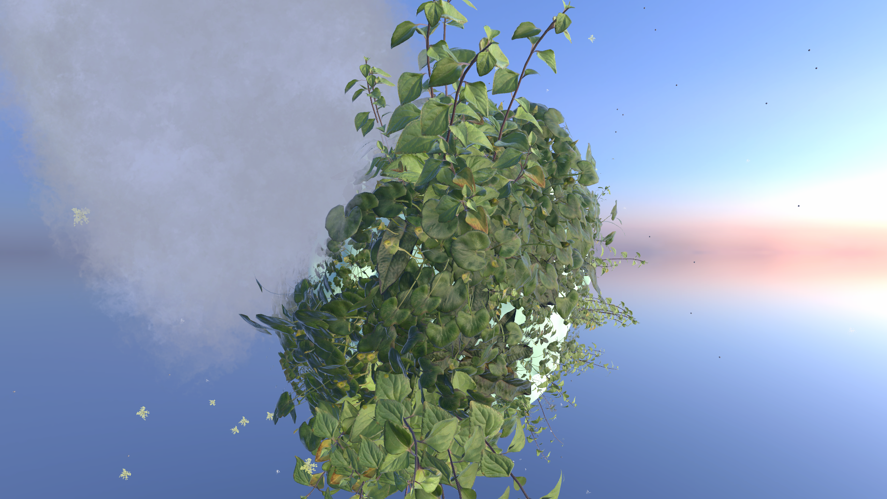
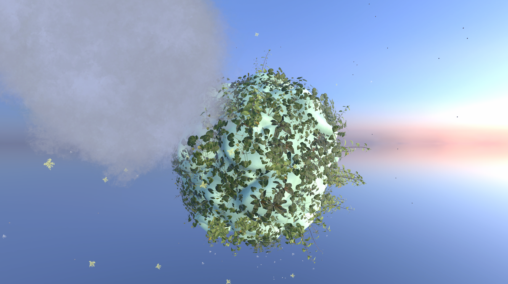

# Unity Exploration Growth

## Concept:
* Small planet with water spring
* Player (like in Black&White 2) takes water from spring and makes rain
* Where it is raining, there plants grow and turn tu green
* Plants after some time dry and change color to yellow

## Images:

Start with randomized plant planet:

Grow plants:

Plant plants:

## TODOs:
* use noise to spawn different plants
* randomize rotation of plants
* Add color change to scaling
* Rotating planet by mouse using RBD apply force on point to cause torque
* Enhance art