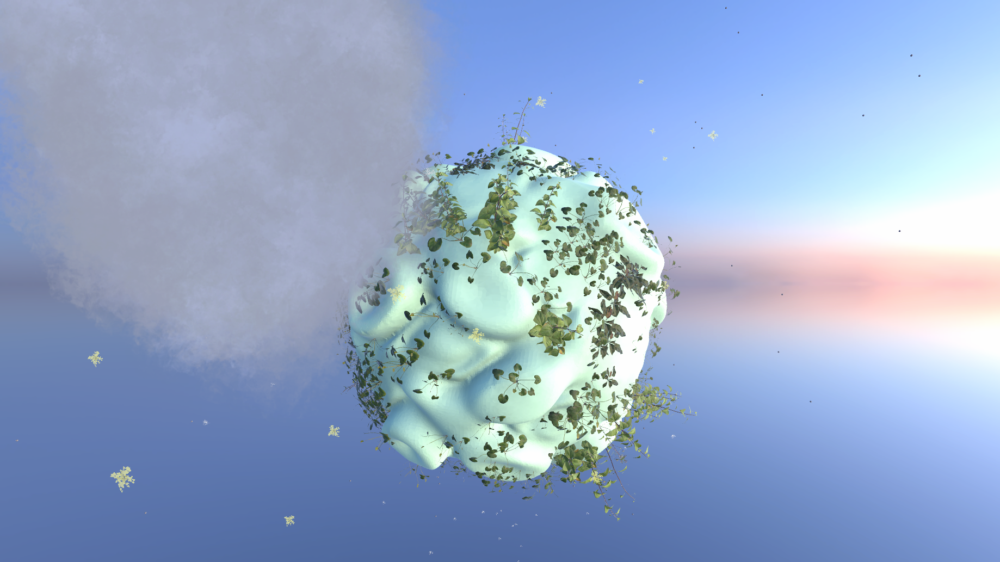

# Unity Exploration Growth

WIP

## Concept:
* Small planet with water spring, clouds and plants
* Player takes water from spring/cloud and makes rain (like in Black&White 2)
* Where it is raining, there plants grow and turn green
* Plants after some time dry and change color to yellow

## Tech
* Geometry instancing using noise and parent object
* Geometry instancing of various objects using noise
* User controlled plant growth
* User controlled plant planting
* User controlled planet manipulation
* Blender assets processing

## Images:

Start with randomized plant planet:

Plant plants:

Grow plants:

## TODOs:
* Ensure minimal distance between plants while spwaning
* Enhance growth animation
* Introduce plants shrinking
* Add taking water from spring/cloud
* Enhance planet art
* Enhance environment art
* randomize rotation of plants
* Add color change to scaling
* Rotating planet by mouse using RBD apply force on point to cause torque